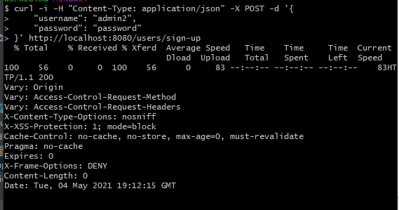
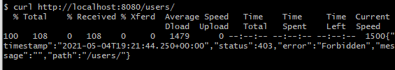
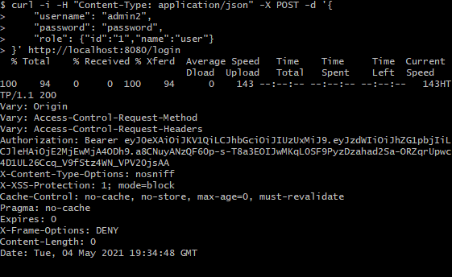
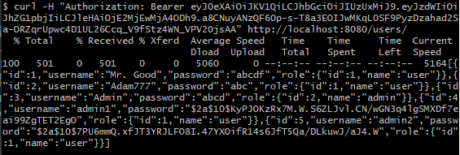

# job4j_chat

### Description of the project.
This project represents the Spring Boot REST full API with the use ***Spring Security & JWT*** for authentication and authorization.
This is a simple restAPI service which implementation of server side for online chat. It is assumed use simple CRUD operations by rooms,messages,persons.

### Used technologies
- Spring Boot 2 as a web framework
- Spring Security & JWT for authentication and authorization
- Spring Data as framework for data base
- Maven as a build system
- PostgresSQL
- liquibase

### Some functionality:
1. Person Registration
   
   

2. Let's check that the security is working. Let's try to get users without authorization
   
   

3. Get a jwt token from this user
   
   

4. Getting all users with a username and password
   
   